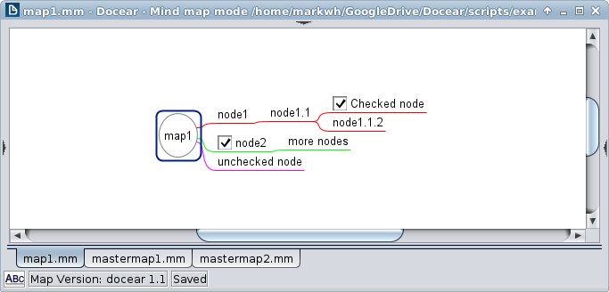
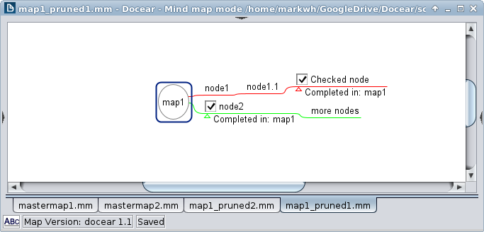
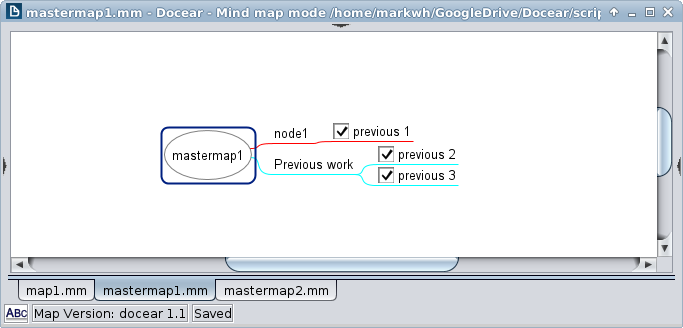
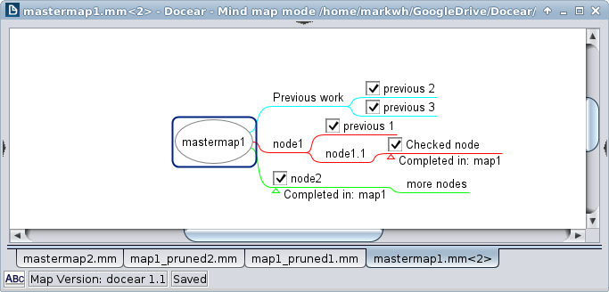
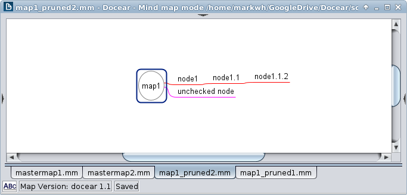
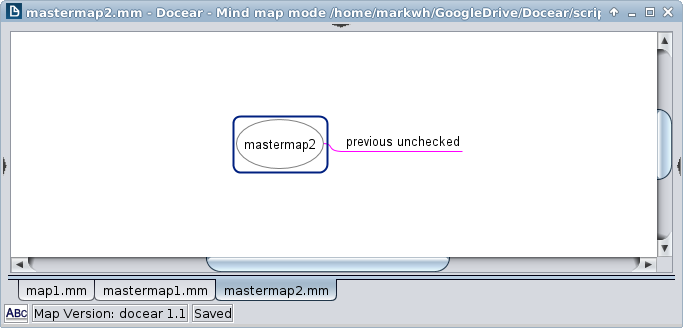
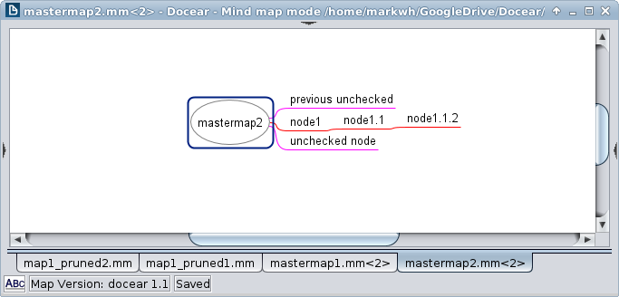

# mynd.py

Utility scripts for mindmapping.

Prune and merge mindmaps using node icons. For use with Freeplane/Docear mindmap (.mm) files. `mynd.py` is run from the command line and has not been tested outside of linux. 

[Freeplane](https://www.freeplane.org/wiki/index.php/Home) (and the related [Docear](http://www.docear.org/)) is a free, open-source tool for [mind-mapping](https://en.wikipedia.org/wiki/Mind_map), with various uses generally related to organization. This project is my own hack to facilitate to-do and task logging using freeplane. It's written in python (not at all my strong suit) partly because I need practice coding in Python. 

#### General workflow

`mynd.py` uses the  icon to denote completed tasks. I recommend creating a keyboard shortcut for adding this icon to a node. Then, from a command-line terminal, run `mynd.py` with the filename of the todo-list mindmap as input. Depending on the arguments supplied, `mynd.py` will complete one of several todo-list actions, potentially changing the target mindmap and/or merging completed tasks into a master tasklog mindmap. Some examples: 

#### Examples

1. Prune away branches that contain no checked nodes

  - And save in place: `mynd.py map1.mm`
  - And save as a new file: `mynd.py -w newmap.mm map1.mm`
  - And merge with an existing map: `mynd.py -m mastermap1.mm map1.mm`

Starting map: 

Pruned map: 

Starting master map: 

Master map merged with new checked nodes:

2. Prune away checked branches to leave only unchecked nodes

  - And save in place: `mynd.py -u map1`
  - And save as a new file: `mynd.py -u -w newmap.mm map1`
  - And merge with an existing map: `mynd.py -u -m mastermap2.mm map1`

Starting map: 

Pruned map: 

Starting master map: 

Master map merged with new checked nodes:

